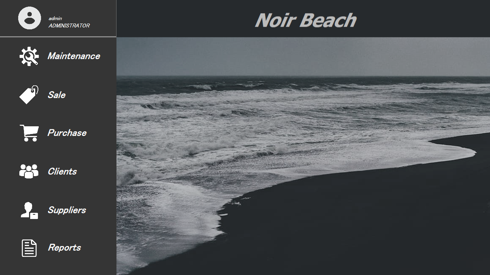
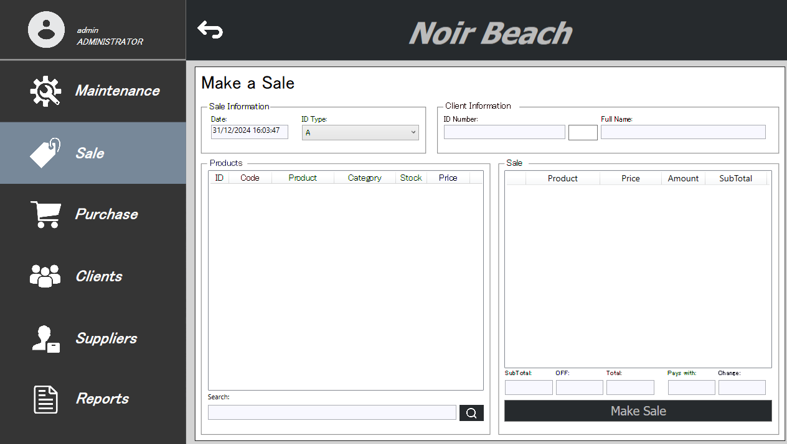
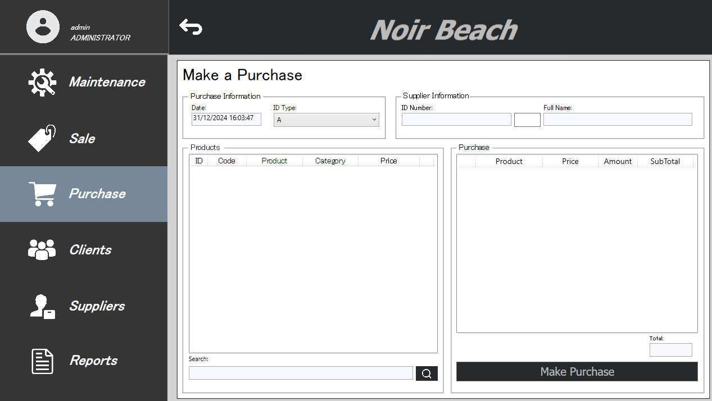
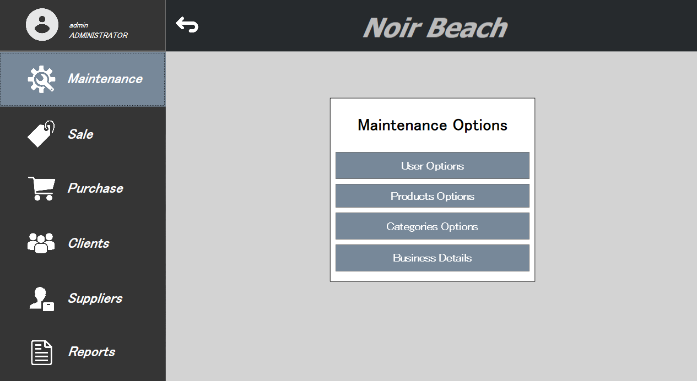
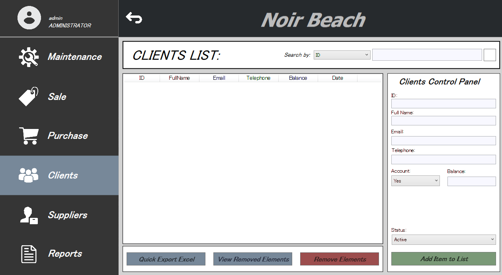
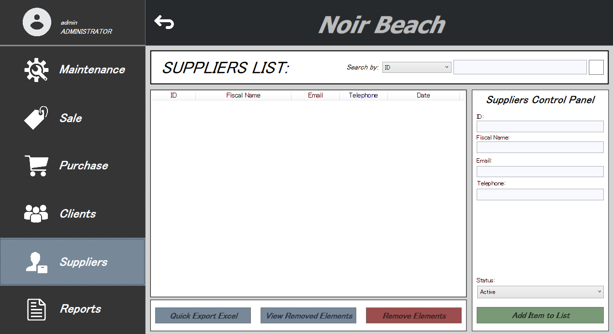
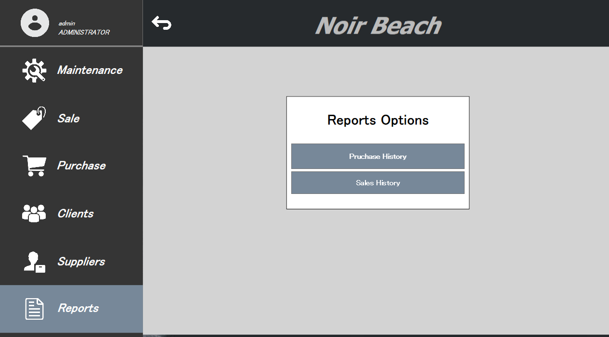
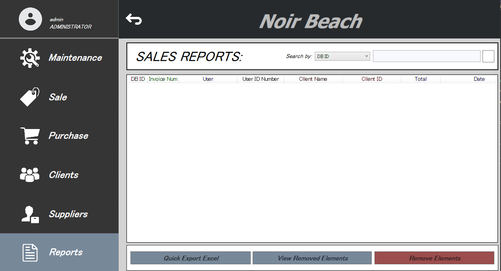
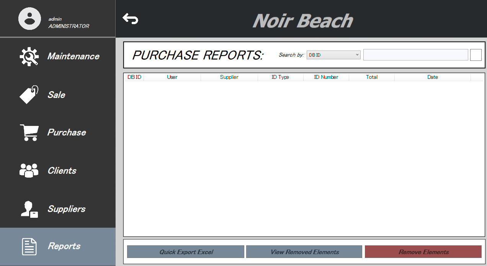

# Noir Beach Fiscal Manager

Noir Beach is a fiscal management program for sales that I created from scratch in C#. It features a 'Windows 7/8' aesthetic, 
lacking the gradients characteristic of Windows 7 but capturing the essence of that era.

This is only a skeleton and should not be used in a real business context. The program is incomplete and requires many features to function properly in a real-world setting. 
It works 'simply' but serves as a solid starting point for a complete solution.
This program is scalable for every feature that you need.

With this program, you can manage sales and purchases for your business, with the possibility of generating invoices for sales. In addition to its primary functionalities, 
the program includes basic database management (in some sections only, while the rest is managed directly via SQL) and features a 'Reports' panel that functions as a history of all transactions.

### Features

- Can make purchases.
- Can make sales.
- Management Panel: This panel allows you to add or remove different entities that are crucial for the proper functioning of the program.
  You can also edit business data.
- Can add and remove Clients or Suppliers for your current business context.
- And has a simplified reports panel where you can see history of sales and purchases.
- Each entity editing section, including the Reports section, can be exported in an "excel" format.
- Can make simplified invoices in sales section, this could be connected to a fiscal printer in a future if you wish.
- Contains a Login system to enter the program (The default ADMINISTRATOR user is admin custadmin)

### DataBase
The build contains a backup made from SSMS. This backup serves as a template for the correct operation of the program.

### Use Case

This is a template, the use case is only for a base. Like I said above, it never be used in a real context or used without complete.

### Sales Maker

 

The Sales Maker panel is equipped with a section to select the billing type (A-D example). Another section for the client, where you can enter your document, 
press the Search button and if it is found, the user will automatically select it, otherwise a window will open with the possible results so that the correct choice can be made. 
We have the catalog section, where we will see the items that we have added to the program with their respective stocks and prices, with a button next to each product to add to the other list, which would be our cart. 
In the cart section we will obviously have the list and a small section where we will see the Subtotal, its result is automatically adding what we have in the cart; 
An OFF that we could add, otherwise we would leave it empty; The Total, which will be automatically modified according to the Subtotal and the OFF that we have added. 
We would have 2 more sections "Payments With" and "Change" depending on the value we enter in Pays With, the corresponding subtraction will be made from the Total to know what change should be returned. 
Finally, we have the 'Make a Sale' button, which verifies whether all sections are correctly filled or if there are any issues. If there is not, it will automatically make the sale, printing a simplified invoice and saving the sale in the database.

### Purchases Maker

This section works similarly to the Sales Maker. To make a purchase, the 'Customer' section is replaced with a 'Supplier' section, and the catalog list no longer depends on stock levels, displaying purchase prices instead.
When you press the button, a simplified invoice will not be printed and the purchase will be saved in the database.

### Maintenance

This template includes a maintenance panel where you can add entities and modify business data. It also allows the creation of employee accounts with an authentication and permission system for each user. 
(Note: Roles and permissions cannot be added through this panel; they must be configured manually via SQL queries.) This panel will be disabled if we enter a user other than ADMINISTRATOR. 
So we will not be able to create users or manage their products or categories.

### Clients and Suppliers Handlers.

These panels allow us to add, disable and delete entities from the database. They work in the same way as the maintenance panels. 
The Suppliers button will be disabled if the logged-in user is not an ADMINISTRATOR, as employees should not be able to edit supplier data.

### Clients and Suppliers Handlers.

The Reports panel allows users to view the history of both purchases and sales. It is similar to the panels for adding or deleting entities but does not permit adding new entries; users can only delete them. 
Only a user with the ADMINISTRATOR permission will be able to access this section.

### Final
That's it, I know it lacks a lot of features, but hey, it's free, and the hardest part of creating the base of the program to make it scalable is already done so you can't complain.
This was a personal project to demonstrate my ability to develop a sales management program from scratch. I previously used a full version of this program for sales, but it became outdated, 
so I decided to create a new version and publish a simplified template. This project took me one month to complete, and I hope you find it useful!
